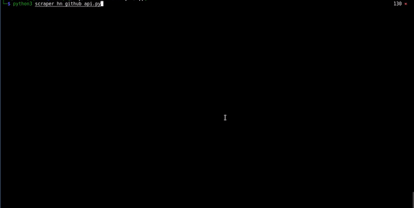

# hacker-news-scraper

<!---Esses são exemplos. Veja https://shields.io para outras pessoas ou para personalizar este conjunto de escudos. Você pode querer incluir dependências, status do projeto e informações de licença aqui--->


<!--

-->





> Implementando um script em python com a funcionalidade de buscar novas notícias sobre tecnologia. O site alvo é o https://news.ycombinator.com/news, no script é utilizado o módulo request do python 
para fazer as requisições.


## 💻 Skills

 


## 💻 Prerequisites

Before starting, make sure you've met the following requirements:
<!---These are example requirements only. Add, duplicate or remove as needed--->
* You have installed [Python](https://www.python.org), Docker and docker-compose.
* You have a `<Windows/Linux/Mac>` machine.


## 🚀 Instalando hacker-new-scraper

Para instalar , siga estas etapas:

```bash
git clone https://github.com/jmreis/hacker-new-scraper.git

```

## ☕ Usando hacker-new-scraper

Para usar, siga estas etapas:

```bash
cd hacker-new-scraper

docker-compose up --build
```

## 📫 Contributing
<!---If your README is long or if you have any specific process or steps you want contributors to follow, consider creating a separate CONTRIBUTING.md file--->
To contribute, follow these steps:

1. Fork this repository.
2. Create a branch: `git checkout -b <branch_name>`.
3. Make your changes and commit them: `git commit -m '<message_commit>'`
4. Push to the original branch: `git push origin <project_name> / <local>`
5. Create the pull request.

Alternatively, see the GitHub documentation at [how to create a pull request](https://help.github.com/en/github/collaborating-with-issues-and-pull-requests/creating-a-pull-request ).


[⬆ Back to top](#hacker-news-scraper)<br>

